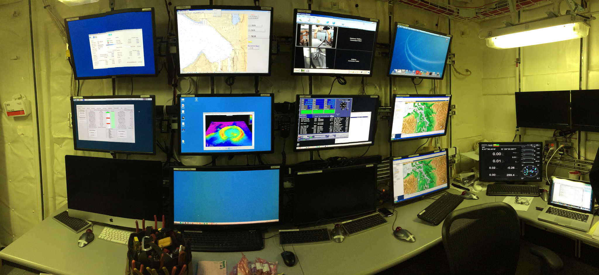
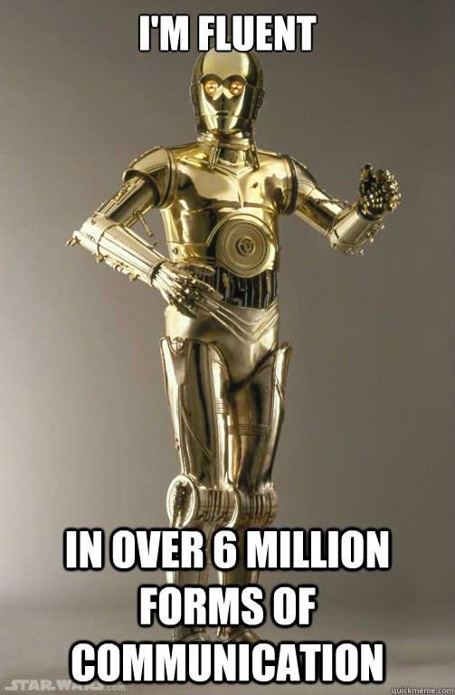
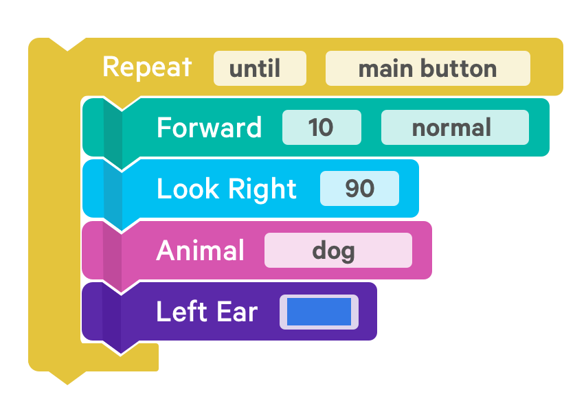
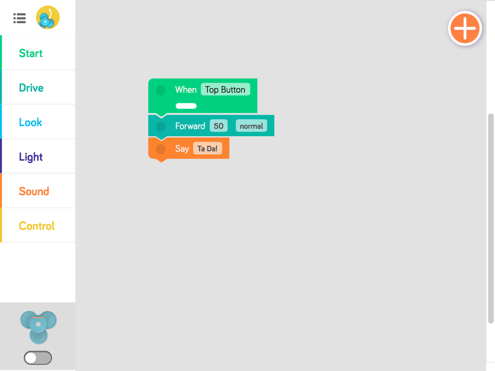
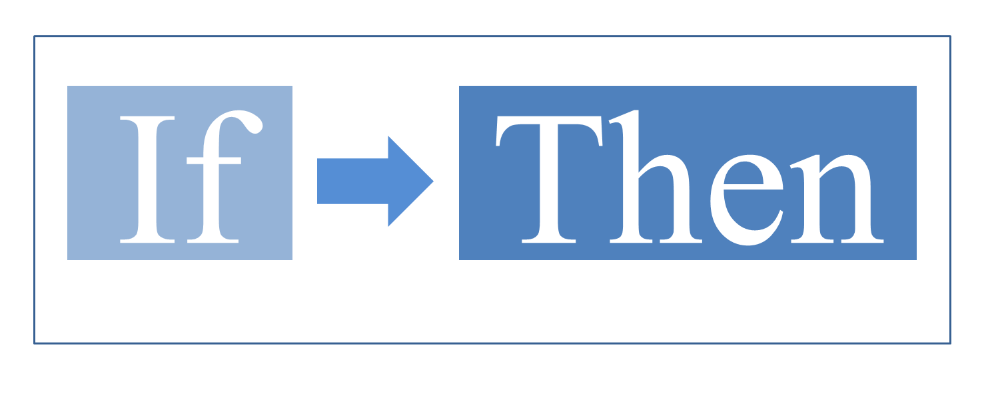
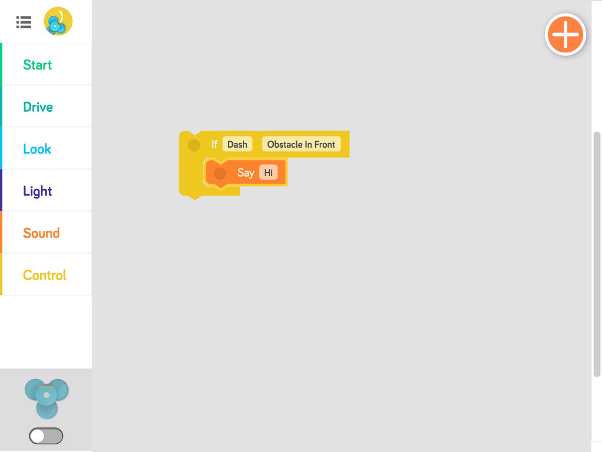
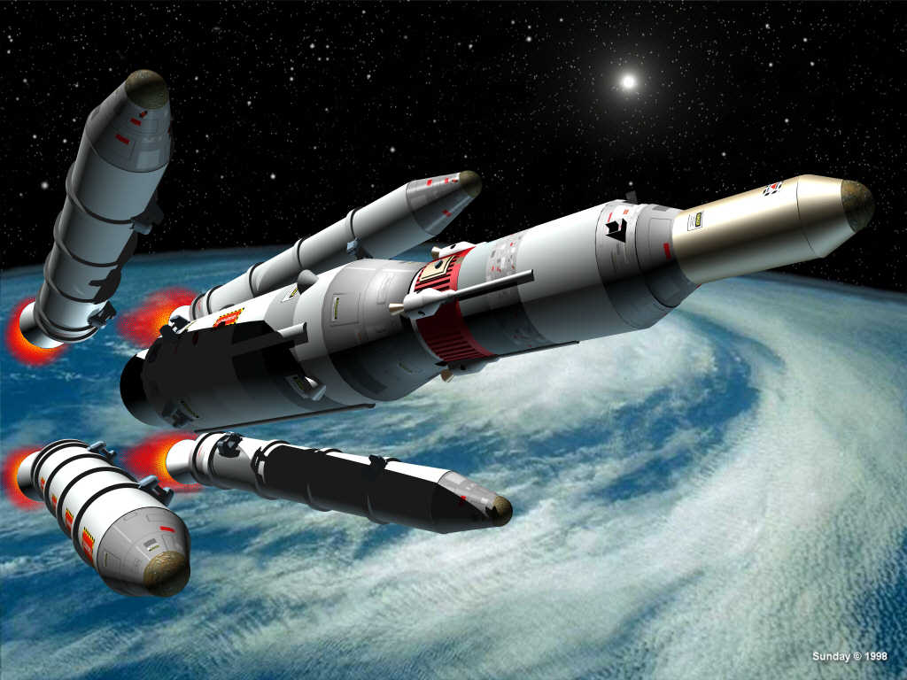
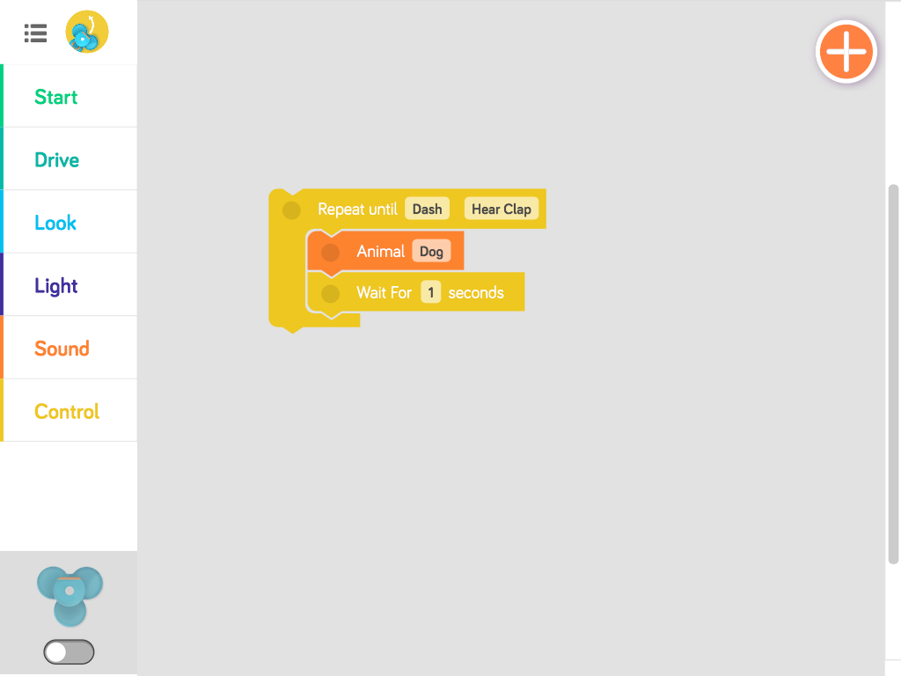
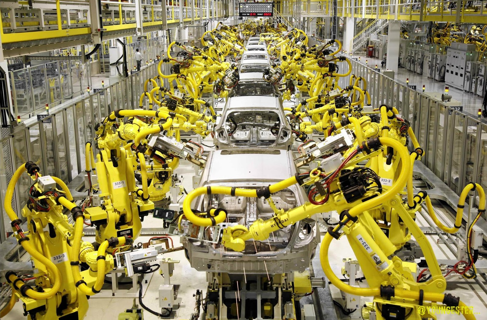
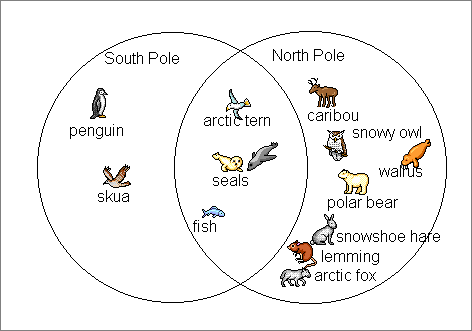

<!------------------------------------------------------------>
<!-- Topic: xxx -->

<h1>Computers</h1>

<h1>Code</h1>

<!------------------------------------------------------------>
--SLIDE--
<!-- Topic: Computers Science -->

<h2>Computer <b>Science</b></h2>

--SUBSLIDE--

<h2><b>Coding</b> can be a job</h2>

<!------------------------------------------------------------>
--SLIDE--
<!-- Topic: Computers -->

<h2><b>Many</b> types</h2>

<h2>of <b>computers</b></h2>

--SUBSLIDE--

<h2>Computers are</h2>

<h2><b>everywhere</b></h2>

<!------------------------------------------------------------>
--SLIDE--
<!-- Topic: Languages -->

<h2><b>Language</b></h2>

<h2>is important</h2>

--SUBSLIDE--

<h2>Computers speak</h2>

<h2><b>many</b> languages</h2>

--SUBSLIDE--

<h1>... called <b>Code</b></h1>

--SUBSLIDE--

<h2>Not all <b>code</b></h2>

<h2>looks <b>scary</b></h2>

--SUBSLIDE--

<h2>Code is <b>Fun</b></h2>

<!------------------------------------------------------------>
--SLIDE--
<!-- Topic: Code -->

<h2><b>Code</b> basics</h2>

--SUBSLIDE--

<h2><b>Input</b> and <b>Output</b></h2>

--SUBSLIDE--

--SUBSLIDE--

--SUBSLIDE--

<h2><b>If</b></h2>

--SUBSLIDE--

--SUBSLIDE--

--SUBSLIDE--

<h2><b>Loops</b></h2>

--SUBSLIDE--

--SUBSLIDE--

<!------------------------------------------------------------>
--SLIDE--
<!-- Topic: Logic -->

<h2><b>Critical Thinking</b></h2>

--SUBSLIDE--

<h2><b>Math</b></h2>

--SUBSLIDE--

<h2><b>Logic</b></h2>

--SUBSLIDE--

<!------------------------------------------------------------>
--SLIDE--
<!-- Topic: Example -->

